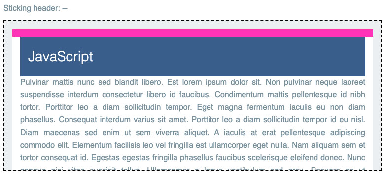
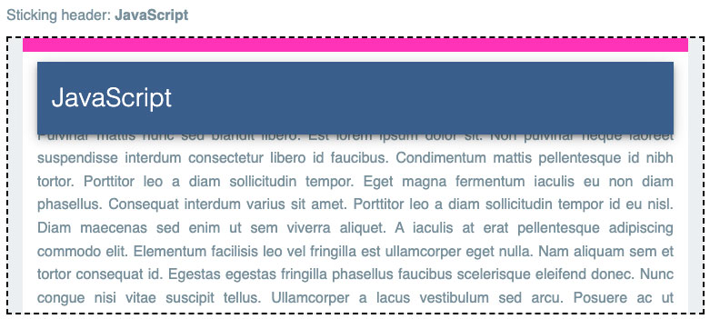
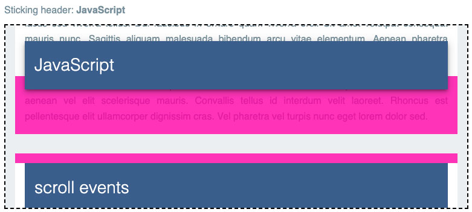
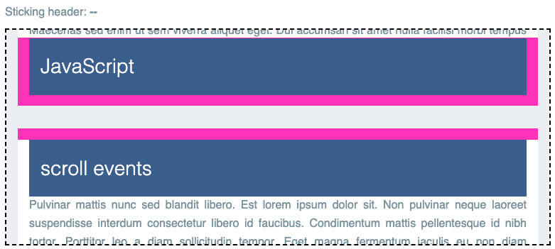

# React Position Sticky

[](https://github.com/allejo/react-position-sticky/releases/latest)
[](https://www.npmjs.com/package/@allejo/react-position-sticky)

A React port of [Eric Bidelman's usage of `IntersectionObserver` for firing a callback when a `position: sticky` element sticks and unsticks](https://developers.google.com/web/updates/2017/09/sticky-headers).

## Installation

It's available via `npm`/`yarn`.

```bash
npm i @allejo/react-position-sticky
# or
yarn add @allejo/react-position-sticky
```

## Usage

This project requires you to use two separate components, the `StickyViewport` and the `StickyElement` components. Both of these components do **not** render any HTML elements (they return React Fragments), instead these components will use refs to your elements.

```tsx
import { StickyElement, StickyViewport } from '@allejo/react-position-sticky';

return (
	<StickyViewport>
		<div className="position-relative overflow-y">
			<article>
				<StickyElement
					onSticky={(stuck) => handleStick(stuck)}
					sentinels={{
						top: {
							top: '0',
							height: '16px',
						},
						bottom: {
							height: '96px',
						},
					}}
				>
					<header className="position-sticky">
						<h2>Article Title 1</h2>
					</header>
				</StickyElement>

				<p>...</p>
			</article>
		</div>
	</StickyViewport>
);
```

## The Components

As mentioned, both of these components do **not** render any new elements in the DOM; instead they attach themselves to their respective children.

### The `StickyViewport`

The `<StickyViewport>` should surround the parent div that is `position: relative`; this is the viewport of where a sticky child will be rendered and can become stuck.

In the above example, our parent div has an `overflow: y` meaning we will treat it as the viewport. However, this is not always the case; sometimes you will want to treat your browser window as the viewport. When this is the case, set the `useBrowserViewport` prop to `true`.

### The `StickyElement`

The `<StickyElement>` should surround the element that is `position: sticky`. This component will automatically add a `data-stuck` attribute to the element it surrounds, which can be used for conditional CSS styling.

Additionally, it also has the `onSticky` callback with a `stuck` parameter indicating whether the element has become stuck or unstuck.

## How to Determine the `sentinels` Prop

[Eric Bidelman's tutorial](https://developers.google.com/web/updates/2017/09/sticky-headers) excellently details _how_ this implementation using `IntersectionObserver` works. However, if you're like me, the magic values used for sentinels didn't make sense. Therefore, here's a visualization on how to calculate the values for sentinels.

In the following images, scrollable containers are indicated by the dashed lines

### The Top Sentinel

The `top` sentinel has two values: `top` and `height`; these props correspond to respective `top` and `height` CSS properties of the top sentinel.

When thinking about how to configure your top sentinel, your goal is to make the following statement true,

> Once the top sentinel starts to disappear outside of the `<StickyViewport>`, then it will be assumed that the `<StickyElement>` has become stuck.

In this example, we have a white container with `position: relative` and 16px of padding. In order to achieve the goal above, we'll state that, once the top padding of this container (indicated in red) starts to disappear, then our `<StickyElement>` has become stuck.





Assuming that once the top padding of the container has begun to disappear, we can define our top sentinel as the size and location of our container's top padding. Using `top` and `height`, we define the top sentinel as being 16px high and at the very top of the parent with `top: 0`.

### The Bottom Sentinel

The `bottom` sentinel has only one value: `height`; which corresponds with the CSS `height` property of the bottom sentinel.

When thinking about how to configure your bottom sentinel, your goal is to make the following statement true,

> Once the bottom sentinel has the `<StickyElement>` entirely inside of it, then it will be assumed that the `<StickyElement>` is no longer stuck.

Continuing our example above, we see that the "JavaScript" heading is still currently stuck as it has not hit the bottom padding of the white container.



Once the "JavaScript" heading has reached its specified bottom relative to the white container, it is no longer stuck.



Using this assumption, we build the bottom sentinel to be as tall as the height of the heading plus the bottom padding of the white container. In this example, the heading's height is 80px and the padding is 16px, meaning our bottom sentinel's height should be 96px.

## License

[Apache 2.0](./LICENSE)
